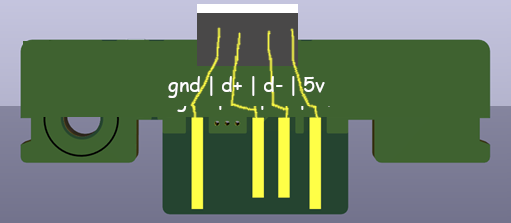
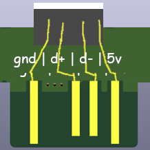

# xbmem2usb
XBMem2USB - Passive USB adapter for original Xbox controllers (Duke / S)

"phat" concept

"slim" concept

"ultraslim" concept

## Credits:
- Ryzee1199 - original Hawk adapter, which this PCB is based off of.
- Friendo the Thievius Raccoonus, founchki + BigBucks000100 for discussing the idea and suggesting improvements!
- Toast for helping out with PCB design :)
